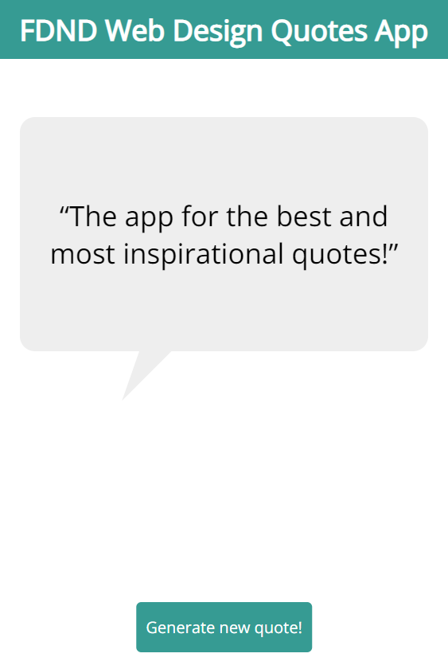
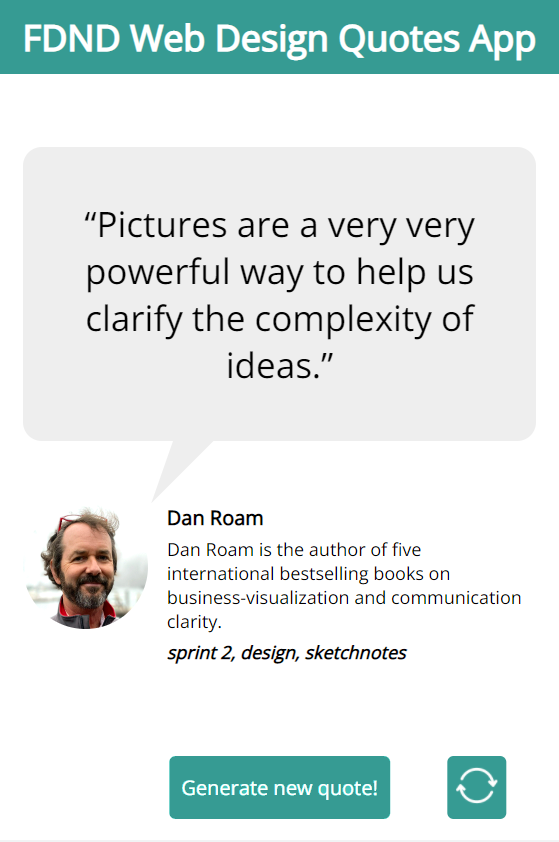
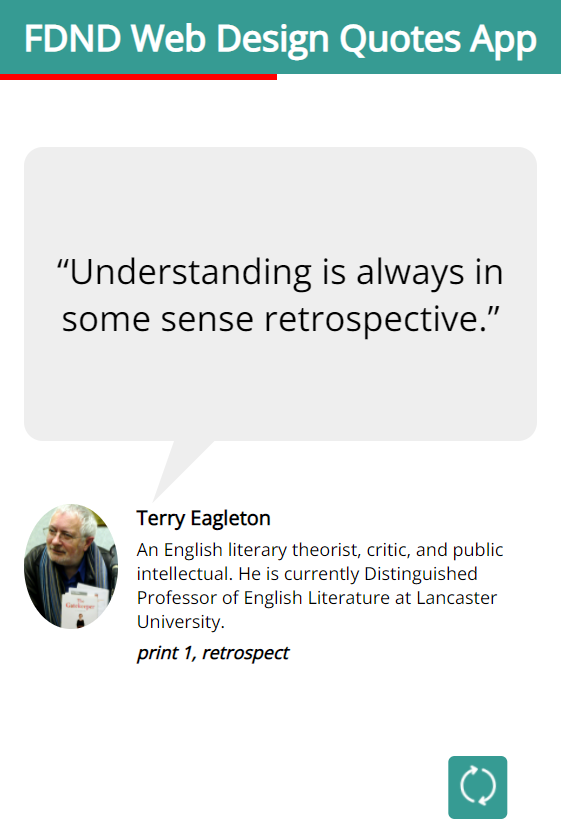
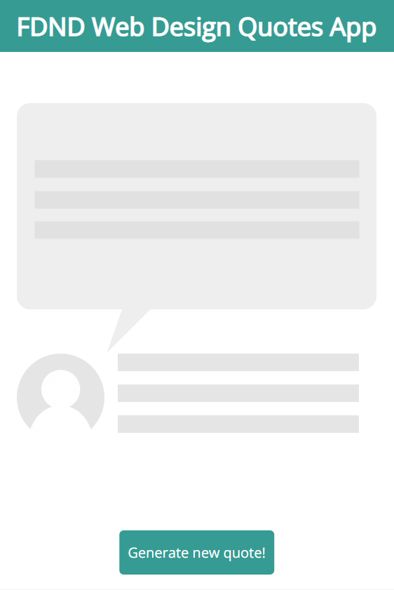
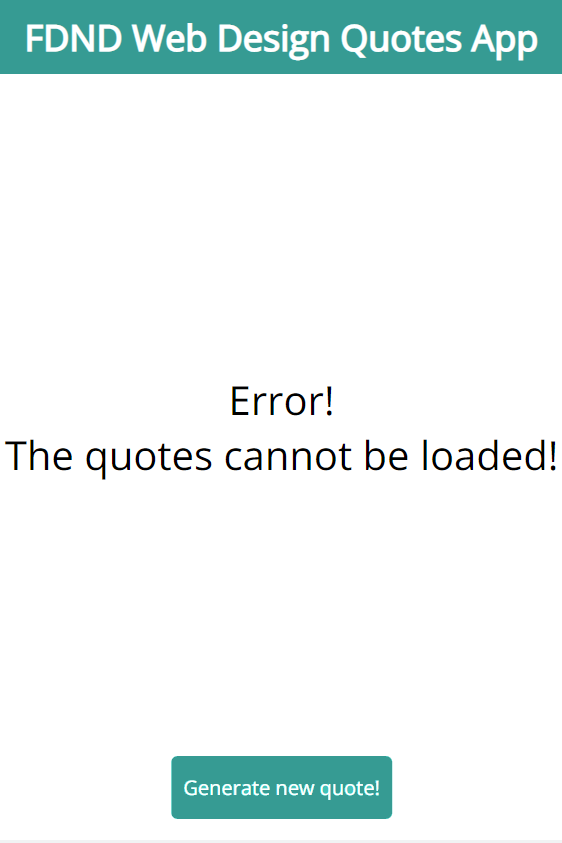
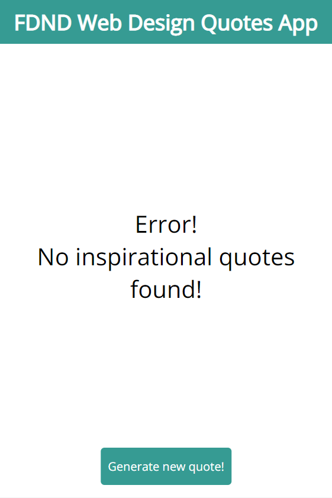
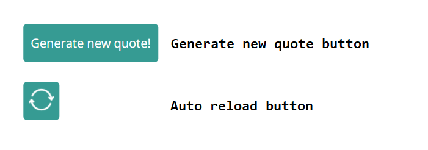

# Documentatie FDND Web Design Quotes App

- [Link naar project:](#link-naar-project-)
- [Beschrijving:](#beschrijving-)
- [User story:](#user-story-)
- [Alle verschillende schermen:](#alle-verschillende-schermen-)
  * [Empty state:](#empty-state-)
  * [Ideal state:](#ideal-state-)
  * [Ideal auto reload state:](#ideal-auto-reload-state-)
  * [Loading state:](#loading-state-)
  * [Error state cannot load quotes:](#error-state-cannot-load-quotes-)
  * [Error state no quotes found:](#error-state-no-quotes-found-)
  * [Installatie:](#installatie-)
  * [Gebruik:](#gebruik-)
  * [Activity diagram:](#activity-diagram-)
  * [External data source:](#external-data-source-)

## Link naar project:
https://dustinschouten.github.io/FDND-Web-Design-Quotes-App/

## Beschrijving:
Dit project is gemaakt en bedoeld voor mensen die op zoek zijn naar inspirerende quotes die gaan over web design en web development. Het is een single page web app die volledig is gemaakt met HTML, CSS en JavaScript waarbij er gebruikgemaakt wordt van de fetch API om data op te halen. Vervolgens worden er op basis van de opgehaalde data quotes gegenereerd.

## User story: 
As a student Digital Design, I want to look at inspiring web design quotes, to get some fresh energy when I'm down while working on crazy deadlines

## Alle verschillende schermen:
Dit project kent een aantal verschillende schermen. Deze schermen zullen in de readme gebruikt worden om naar te refereren.

### Empty state:

### Ideal state:

### Ideal auto reload state:

### Loading state:

### Error state cannot load quotes:

### Error state no quotes found:

Hieronder is een breakdown schets met een beknopte beschrijving van de JavaScript functies weergegeven:

## Installatie:
Om deze single page app te installeren, dien je deze repo te clonen naar je apparaat:
Dit doe je met `git clone https://github.com/DustinSchouten/FDND-Web-Design-Quotes-App.git`
Gebruik een live server om de website te hosten. De app werkt niet als je deze vanaf je bestandssysteem laat draaien.

## Gebruik:
Het gebruik van deze app is relatief eenvoudig, door het beperkte aantal interacties dat de app heeft. De app kan d.m.v. twee verschillende buttons worden bediend. Zie het plaatje hieronder:

Het eerste scherm dat de gebruiker te zien krijgt is de empty_state. Hierbij is alleen de 'Generate new quote' button te zien. Wanneer hierop geklikt wordt en het proces loopt goed, dan wordt de ideal state getoond. In dit scherm wordt er een willekeurige quote met bijbehorende gegevens geladen en getoond. 
In dit scherm verschijnt vervolgens ook de Auto reload button. Wanneer hierop geklikt wordt, wordt de ideal auto reload state getoond. Er wordt dan om de vijf seconden een nieuwe quote gegenereerd. Als de gebruiker opnieuw op deze button klikt, gaat de gebruiker weer terug naar de ideal state en verschijnt de 'Generate new quote' button weer.

## Activity diagram:
Hieronder zie je het activity diagram met een wireflow en een control flow van de code.

## External data source:
De data die in deze single page app wordt gebruikt, is afkomstig van een data-API.
Link naar de API: https://quote.api.fdnd.nl/v1/quote

In deze gegevensbron bevinden zich een aantal data-objecten. Uit elk object worden onderstaande waardes gehaald:
- de quote
- de naam van de auteur
- de (beknopte) biografie van de auteur
- enkele bijbehorende tags
- een url van een foto van de auteur

Om de data op te halen is gebruikgemaakt van de fetch API.

- Add a checklist of done stuff and stuff you have still on your wishlist ✅
