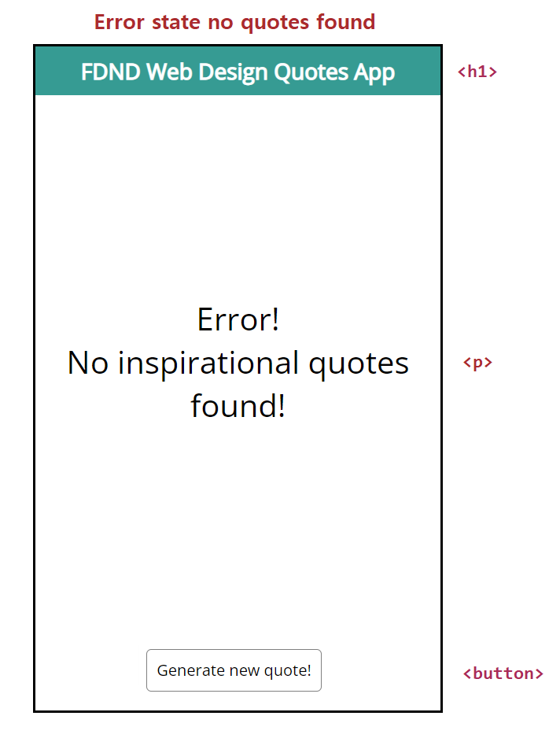
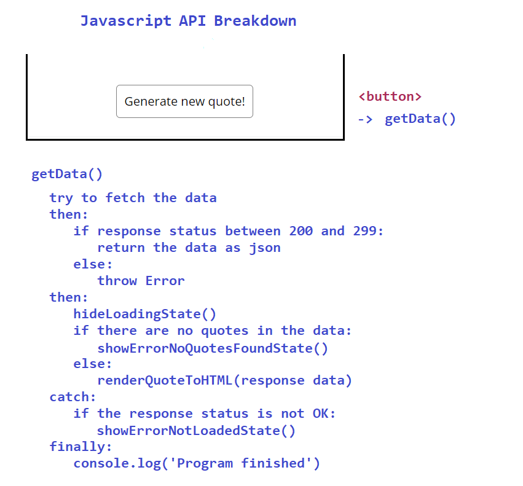

Link naar project: https://dustinschouten.github.io/FDND-Web-Design-Quotes-App/

# Documentatie FDND Web Design Quotes App

## Introductie:
Dit project is gemaakt en bedoeld voor mensen die op zoek zijn naar inspirerende quotes die gaan over web design. Het is een web app die volledig is gemaakt met HTML, CSS en JavaScript waarbij er gebruikgemaakt wordt van de fetch API om data op te halen.

## User story: 
As a student Digital Design, I want to look at inspiring web design quotes, to get some fresh energy when I'm down while working on crazy deadlines

## Alle verschillende schermen:
Dit project kent een aantal verschillende schermen:

### Home screen:

### Ideal state:

### Loading state:

### Error state cannot load quotes:

### Error state no quotes found:

Hieronder is een breakdown schets met een beknopte beschrijving van de JavaScript functies weergegeven:

Ondertussen is de code gerefactord en is er een auto_reloader toegevoegd. Van de code is hier een activity diagram toegevoegd.
